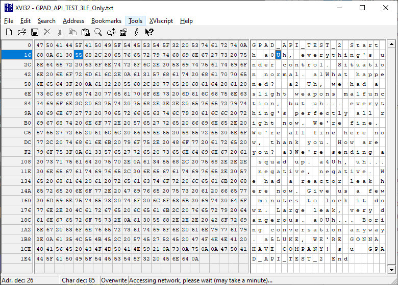
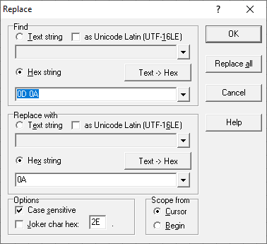

# GPAD API TEST 1

## Summary
This is folder contains files to test the GPAD_API through the serial port using a terminal program.
Example, the text file, GPAD_API_TEST_1.txt is sent by RealTerm to the device under test, DUT.

## Test Files
File names and descriptions.
* GPAD_API_TEST_1.CRLF.txt  This file has CR and LF end terminations.
* GPAD_API_TEST_2.CRLF.txt Similar to GPAD_API_TEST_1 but with messages added. This file has CR and LF end terminations.
* GPAD_API_TEST_2LFOnly.LF.txt Similar to GPAD_API_TEST_1 but with messages added. This file has LF end terminations.
* GPAD_API_TEST_3LF_Only.LF.txt This file has help command and only Alarms with messages and only LF end terminations.
* GPAD_API_TEST_ALPHANUM1.LF.txt This file has upper case, lower case and numeric test characters `~!@#$%^&*()-_=+.[]{}\|;:'",<.>/?
* GPAD_API_TEST_LONGLINE.LF.txt This file has very long line of alphan numeric text.

## Cases of Using RealTerm and XVII32
RealTerm is set up for a 4000 mSecond end of line delay.
RealTerm is set up for to repeat endlesly by setting the number of repeats to zero.  

**Note:** in the RealTerm, Port setup tab you must select with the Open button and press Change button after changes. Using RealTerm on a DUT will conflict with the Arduino IDE on the same DUT. To program with the Arduino IDE, you must un Open the port and press Change to release the port for the Arduino IDE.

Screen shot showing the RealTerm setup and typical serial traffic.

Lee used the very helpful program **XVI32** to review and edit the files with the desired line terminations.  
Example of file in **XVI32** in action.
  
Screen shot showing the XVI32 find and replace to replace CRLF with LF only.  

## References

XVI32 can be downloaded from what appears to be the author here: http://www.chmaas.handshake.de/delphi/freeware/xvi32/xvi32.htm#download

The program **RealTerm** can be downloded from: https://sourceforge.net/projects/realterm/

## License

* Firmware: GLP 3
* Hardware CERN Open Hardware License Version 2 - Strongly Reciprocal
