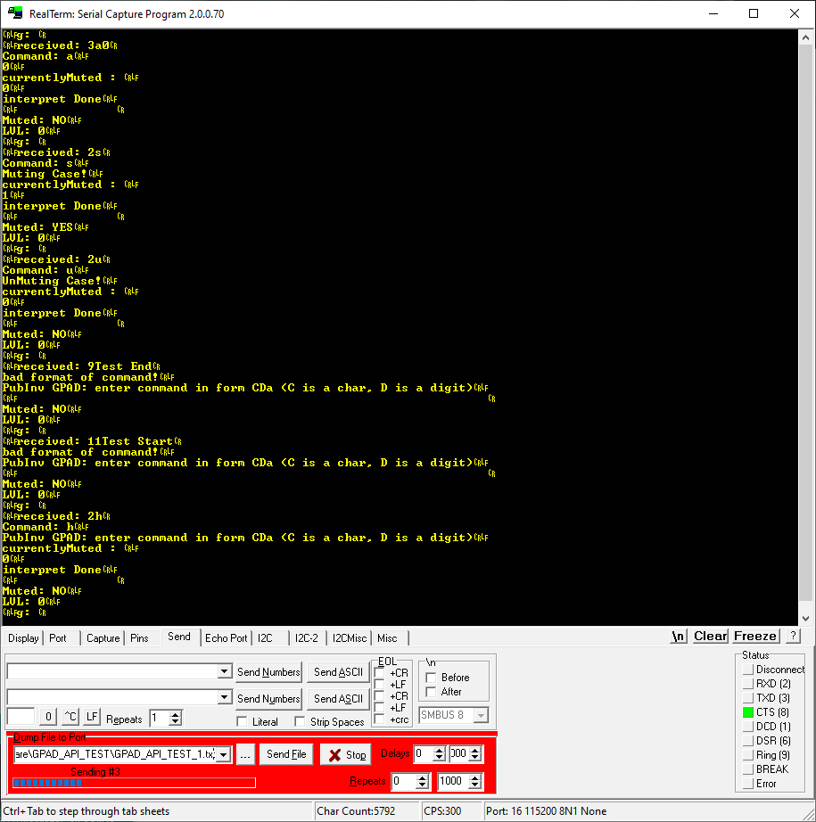

# GPAD API TEST 1

This is folder contains files to test the GPAD_API through the serial port.
The text file, GPAD_API_TEST_1.txt is sent by RealTerm to the device under test, DUT.
RealTerm is set up for a 4000 mSecond end of line delay.
RealTerm is set up for to repeat endlesly by setting the number of repeats to zero.

Screen shot showing the setup and typical serial traffice.

Test Files:
GPAD_API_TEST_1

# License

* Firmware: GLP 3
* Hardware CERN Open Hardware License Version 2 - Strongly Reciprocal
