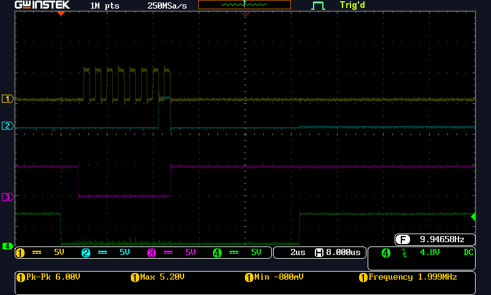
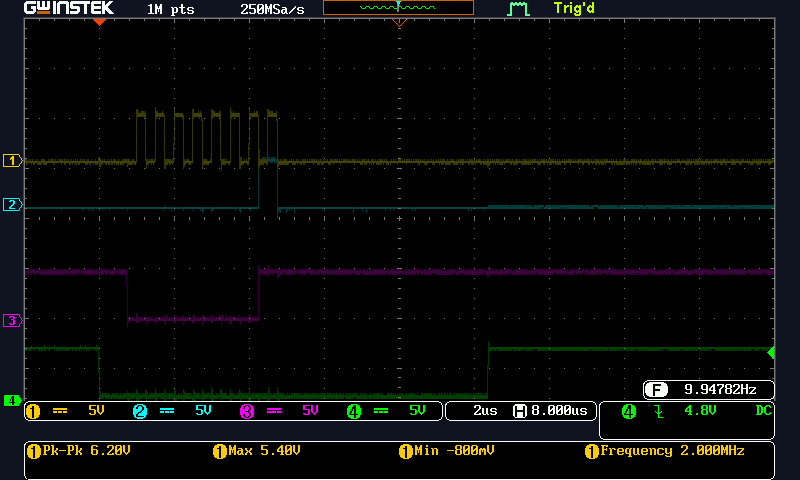

# SPI_Controller_And_Peripheral
A SPI Controller and Peripheral solution for Arduino UNO. Use two UNOs. One becomes the controller. One becomes the peripheral. 

SPI_CONTROLLER and SPI_PERIPHERAL
   From: https://circuitdigest.com/microcontroller-projects/arduino-spi-communication-tutorial
   Modified by Forrest Lee Erickson 20220523  
   Change to Controller/Peripheral terminology  
   Change variable names for start with lowercase. Constants to uper case.  
   Controller Arduino Code:     
   License: Dedicated to the Public Domain  
   Warranty: This program is designed to kill you and render the earth uninhabitable,
   however it is not guaranteed to do so.  
   20220524 Controller and Peripheral working.
   

## Hardware Notes, SPI Signal Names
>  SPI Line Pin in Arduino, IO type  
>  MOSI 11 or ICSP-4,  Output  
>  MISO 12 or ICSP-1, Input  
>  SCK 13 or ICSP-3, Output  
>  SS 10,  Output  

## Bus waveforms.  
### CH1 is SCK, CH2 is MISO, CH3 is MOSI, and CH4 is nCS
  
SPI Bus ControlerButtonPressed  
  
SPI_Bus_NoButtonsPressed  
  
SPI_Bus_PeripherialButtonPressed
  
  

