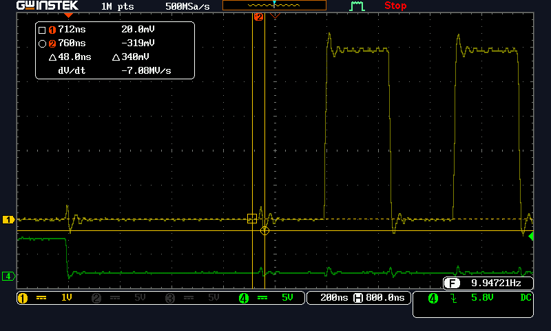
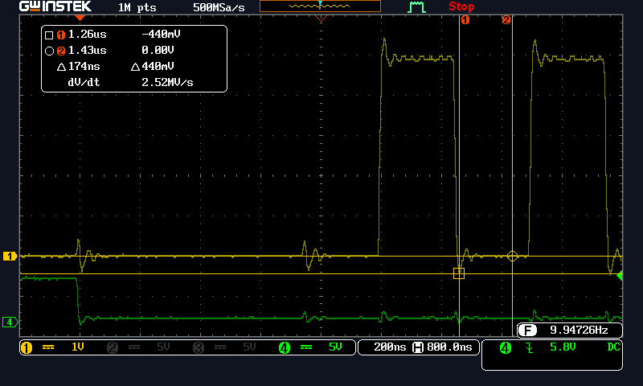
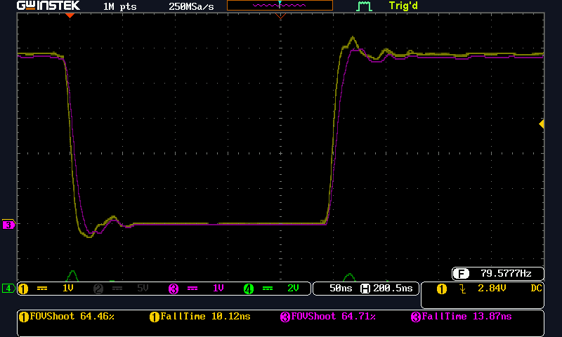
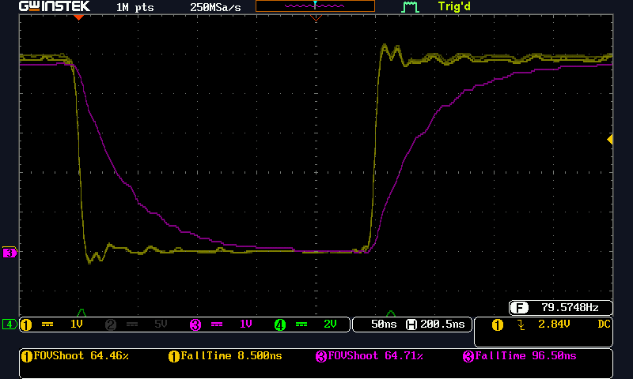
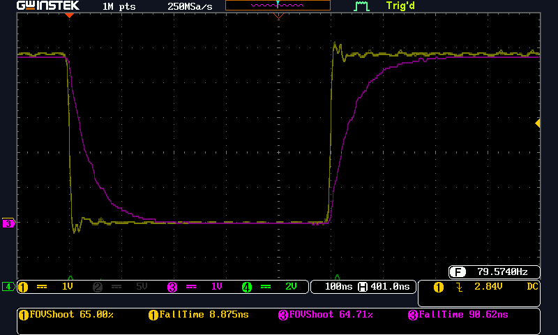
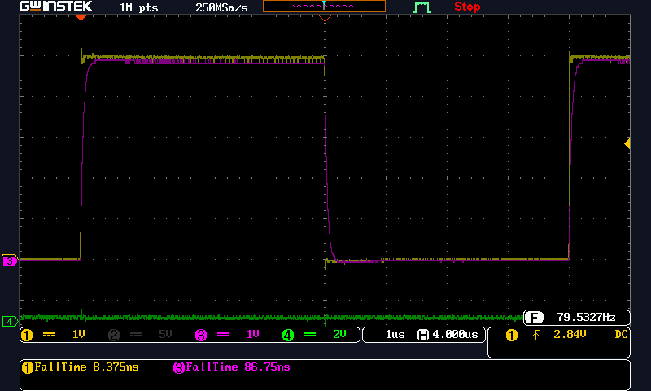

# Signal Inetgrity for SPI_Controller_And_Peripheral
A SPI bus signal integrity. Managing overshoot with Series termination.
A series resistor near the IC pin driving the signal line of between 200 and 1K Ohms is advisable.
Slowing the SPI clock down to ensure the data is latched after the rise and fall time is good to do.
At 125KHz an 8 bit data will be 15.625K bytes per second. Or 64 uS per byte.  
For a 20x4 character display disregarding any setup or cursor management bytes this would be still take only 5.2 mS

## Hardware Notes, SPI Signal Names
>  SPI Line Pin in Arduino, IO type  
>  MOSI 11 or ICSP-4,  Output  
>  MISO 12 or ICSP-1, Input  
>  SCK 13 or ICSP-3, Output  
>  SS 10,  Output  

### Wiring of Solderless Bread Board.
Image showing the wiring using solderless bread board and flying wires. Only skinny ground wire connecting each UNO to the solderless bread board.
This kind of wiring is the opposite of what you want for signal integrity.  
  
In this image the SCK wire has a series resistor on the solderless bread board for experiments on controling rise time.  

## SPI Waveforms.  
### CH1 is SCK, CH2 is MISO, CH3 is MOSI, and CH4 is nCS
  
SPI SCK showing bounce due to /SS signal transistion.  

  
SPI SCK showing unsershoot of about 440mV.  The ATmega328 specifies signals no more than 0.5V so jsut within specification on these leads of about 10 inches.  

### CH1 is SCK, CH3 is SCK after Series Resistor, and CH4 is nCS
  
SPI SCK showing unsershoot with series resistor of 100 Ohms. Now about 300mV.  Slight signal fall time slow down.

  
SPI SCK showing unsershoot with series resistor of 1K Ohms. No overshoot.  Significantt signal fall time slow down of obout ten times.  
A value of about 200 ohms might have made minimum overshoot and undershoot with minimal slow of rising and falling edges.
The communication between Controller and Perhpherial was still reliable with these slow edges.
This SPI clock was 2MHz.

### Next, Let's Experiment With Slower SPI Clock  
  
SPI SCK set for lower data rate of 1MHz. Still using 1K Ohm series resistor.

  
SPI SCK set for lower data rate of 125HHz. Still using 1K Ohm series resistor.

  

