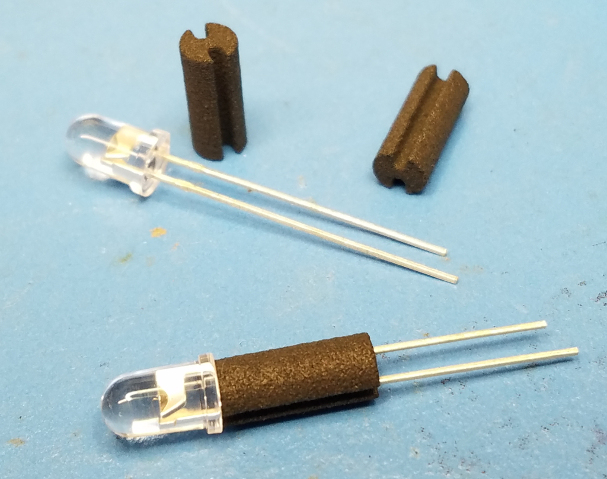
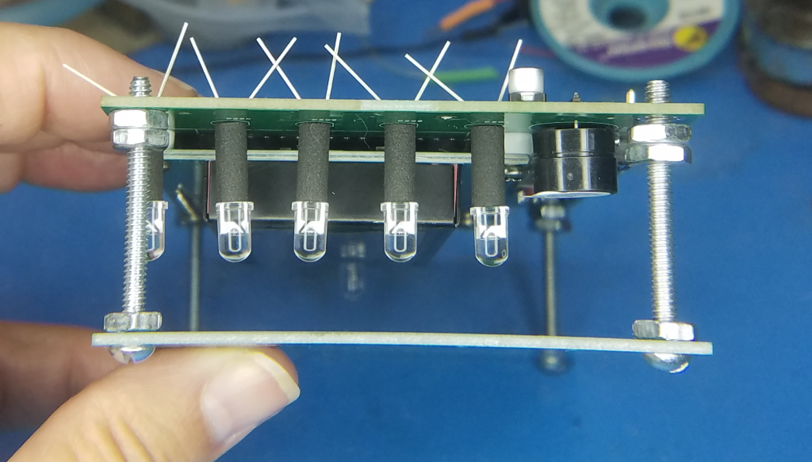
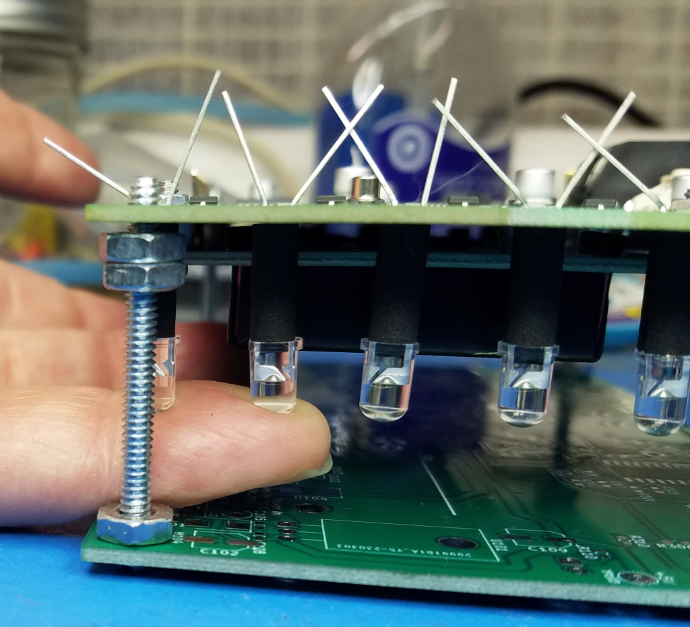
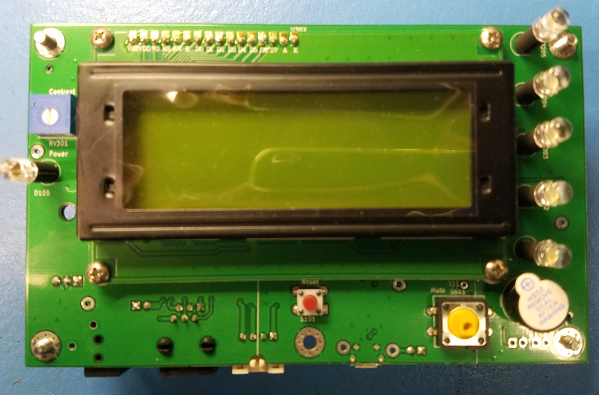
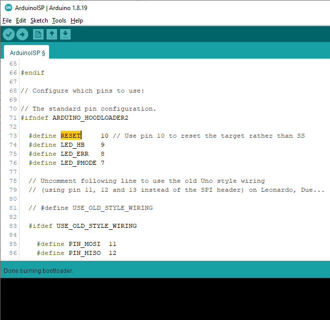

# Manufacturing and Unit Test Documentation, PCB Version 2.0, 20230228
These notes were made during the assembly of the JLCPCB order of about March 2023.  
These units will be assigned serial numbers 16 through 30.  

#### Sections below
* Manufacturing test procedure for every unit  
**Assembly Notes and Tips  
** Unit (Design) verification tests on some units  
** Configuration Version 1 Assemblies 
* GPAD Theory of Operation  
* Troubleshooting procedures  

## Manufacturing test procedure for every unit

### Tools Required

Solder station with approprate ventelation
3/16 Nut Driver 
Number 1 philips screw driver
Diagonal or other flush cutting hand tool for lead trimming.
Assembly fixture, detailed below.

### Reference Material

The most recent schematic is for Rev 2 PCB Assemblies is: [Schematic-GeneralPurposeAlarmDevicePCB-V2.2.pdf](/Hardware/GeneralPurposeAlarmDevicePCB/PDF/Schematic-GeneralPurposeAlarmDevicePCB-V2.2.pdf)

### Assembly Notes and Tips

As received from JLCPCB.
Note the assembly has the SMT components placed by the board manufacturer and some but not all through hole components. 

Write serial number on the PCB assembly at the location indicated. _Management of serial numbers is beyound the scope of this document. Each manufacturer must figure something out._

### An Assembly Fixture
We made an assembly assistant / fixture by using a raw PCB with some long #6 screws and nuts to hold at the PCB mounting points. 

Also four 4.40 screws with washers and 4-40 nuts to make a 1/8" spacer for holding the LCD and header for soldering.

### Assembly Steps  
 
1. LCD Bezel Grounding.
On the LCD module locate the J1 and J2 solder pads which if soldered ground the bezel.   
<a href="LocateJ1J2.jpg"> View of J1 and J2.</a>  
Solder them.  
<a href="SolderJ1J2.jpg"> Solder on of J1 and J2.</a>  
As soldered.  
2. The 16 pin header is fit and soldered on to the LCD sub module. Then the pins are placed through the GPAD PCB. Four, nylon 1/8" spacers are placed at the four corners of the LCD sub module. Four 4-40 x 3/8" screws with 4-40 x 3/16" nuts go through both boards and are torqued to 3.4 - 4.8 Inch-Pounds. Solder the LCD header pins into the GPAD PCB.
TIP: Using the assembly fixture the 16 pin header can be held flush to the LCD module to solder a center pin to start the process.  
<a href="AssemblyFixtureView2.jpg"> Assembly Fixture View 2</a>  
<a href="HeaderToLCD.jpg"> View of holding header to LCD.</a>  
3. Put Reset button, S101 into PCB from display side.
4. Put Mute button, S401 into PCB from display side.
5. Put Buzzer, BZ601 into PCB from display side.  Bending leads may help retain.
6. Put Contrast pot, RV301 into PCB from display side.  Bending leads may help retain.  
7. Through hole LEDs at locations D201-D205 and D105 with a stand off spacer.  
<a href="./PICS/Rev2/LED_and_Spacers.png"> LEDs with spacers.</a>  
Thread the LED leads through the stand offs.  The longer LED lead is the anode. The cathod has a flat side on the plastic case.  
Place the LEDs in to the PCB so that the flat cathode side coorisponds to the silk screen marking. Bend the leads to retain the LED into the PCB.  Placing the assembly on the fixture lets you have access to the top and the bottom of the assembly.  
<a href="./PICS/Rev2/LEDs_for_Soldering.png"> Assembly Fixture View with LEDs ready for soldering.</a>
<a href="./PICS/Rev2/fingerlift_led.png"> Life LED and reflow solder for a flush fit on the PCB.</a>   
For each LED, after soldering one lead, holding the LED from below up to the spacer and the PCB and reheat / reflow the solder for a flush fit.  
Solder the second lead on the LED.  
Trim the excess leads on RV301 and the LEDs.

**Rejoice! Electircal assembly is done.**  
<a href="./PICS/Rev2/PWA_FrontView.png">  
LCD side components installed.</a>  

### Electrical Tests
Electrical tesets are in two parts. Unprogramed measurements made before programing the boot loader and other firmware and Programed measurements made after a boot loader and firmware have been placed into the microcontroler.

#### Electrical Measurements before programing bootloader and firmware
Measure and record by serial number the following electrical parameters.
Investigate and correct abnormal measurements before applying power.  Remove J102 and J103 and retain if present. Note where they should be replaced.
Start with no connections to the DUT (Device Under Test).

**Power Jack** Measure resistance to ground at J101 center pin as greater than **TBD** ohms.

**SPI Interface** Measure resistance to ground at J401 pin 5 as greater than **TBD** ohms.

**VinV net** Measure resistance to ground at TP102 as greater than **1 Meg** ohms.  This net is capacitive and the resistance measured will climb as the meter charges the net.

**+5V net** Measure resistance to ground at TP103 +5 as greater than **TBD** ohms.

With a current limited supply set for 12V and maximum of **TBD** mA, apply power at J101 and note and record the un programed current.
(FYI, when unprogrammed, the first time power up current is normally about **TBD** mA.)

Check that the power LED D105 is lit and is RED.

**+5V net** Measure the voltage of the +5V Net at TP103.

(FYI, a programmed DUT that has been powered up, and with display back light on, Hold the reset switch and measure current as about **61** mA)

**Vo Intitial Set / LCD Contrast.**  
With a volt meter, measure the voltage of the Vo pin of the LCD headder to ground. Adjust RV103 for 1.3 V.
This is an initial guess. Later in the process will be the actual setting of the contrast.
See records of measurements of some of the Rev 2 assemblies at this issue: https://github.com/PubInv/general-alarm-device/issues/217 #217

**Electrical Test Results Table**

In Tennessee:
* All resistance measured on 20Meg scale except R@5V net measured on 2K scale. Multi meter EMCO Model DMR-3800 unless noted.   
* All current measured 200mA scale. Multi meter EMCO Model DMR-3800 unless noted.  

Capture:
DUT Serial Number, R@PowerJack, R@SPI Interface, R@Vin net, R@5V net, UnProgramCurrent, Volt@+5 TP103, FullCurrent mA, Vo Volts, Notes

<table style="background-color:#DDDDEE">
  <tr><th>DUT Serial Number</th> <th>R@PowerJack</th> <th>R@SPI Interface</th> <th>R@Vin net</th> <th>R@5V net</th> <th>UnProgramCurrent</th> <th>Volt@+5 TP103</th><th>FullCurrent mA</th> <th>Vo Volts</th> <th>Notes</th></tr>
  <tr><td>01</td> <td>___</td> <td>___</td> <td>___</td> <td>___</td> <td>___</td> <td>___</td> <td>___</td> </tr>
  <tr><td>02</td> <td> >2Meg</td> <td>>2Meg</td> <td>>2Meg</td> <td>>2Meg</td> <td> 61 mA with LCD back light on</td> <td>5.04V</td> <td>119 mA</td> <td>1.29</td> <td>Not measure un programed.</td> </tr>
  <tr><td>03</td> <td>1.5Meg</td> <td>Open</td> <td>490K</td> <td>1.052K</td> <td>68.4 LCD ON</td> <td>5.03</td> <td>118</td> <td>1.29</td> <td> </td> </tr>
  <tr><td>04</td> <td>1.5Meg</td> <td>Open</td> <td>320K</td> <td>1.052K</td> <td>68.5 LCD ON</td> <td>5.02</td> <td>118</td> <td>1.30</td> <td> </td> </tr>
  <tr><td>05</td> <td>980K</td>   <td>Open</td> <td>500K</td> <td>1.052K</td> <td>68.8 LCD ON</td> <td>5.03</td> <td>118</td> <td>1.33</td> <td> </td> </tr>
  <tr><td>06</td> <td>1.3Meg</td> <td>Open</td> <td>250K</td> <td>1.052K</td> <td>68.7 LCD ON</td> <td>5.03</td> <td>118</td> <td>Vo=1.29</td> <td> </td> </tr>
  <tr><td>07</td> <td>___</td> <td>___</td> <td>___</td> <td>___</td> <td>___</td> <td>___</td> <td>___</td> <td>___</td> </tr>
  <tr><td>08</td> <td>___</td> <td>___</td> <td>___</td> <td>___</td> <td>___</td> <td>___</td> <td>___</td> <td>___</td> </tr>
  <tr><td>09</td> <td>___</td> <td>___</td> <td>___</td> <td>___</td> <td>___</td> <td>___</td> <td>___</td> <td>___</td> </tr>
  <tr><td>10</td> <td>___</td> <td>___</td> <td>___</td> <td>___</td> <td>___</td> <td>___</td> <td>___</td> <td>___</td> </tr>
  <tr><td>11</td> <td>___</td> <td>___</td> <td>___</td> <td>___</td> <td>___</td> <td>___</td> <td>___</td> <td>___</td> </tr>
  <tr><td>12</td> <td>___</td> <td>___</td> <td>___</td> <td>___</td> <td>___</td> <td>___</td> <td>___</td> <td>___</td> </tr>
  <tr><td>13</td> <td>___</td> <td>___</td> <td>___</td> <td>___</td> <td>___</td> <td>___</td> <td>___</td> <td>___</td> </tr>
  <tr><td>14</td> <td>___</td> <td>___</td> <td>___</td> <td>___</td> <td>___</td> <td>___</td> <td>___</td> <td>___</td> </tr>
  <tr><td>15</td> <td>___</td> <td>___</td> <td>___</td> <td>___</td> <td>___</td> <td>___</td> <td>___</td> <td>___</td> </tr>  
  <tr><td>16</td> <td>___</td> <td>___</td> <td>___</td> <td>___</td> <td>___</td> <td>___</td> <td>___</td> <td>Vo=1.??</td><td> </td>  </tr>  
  <tr><td>17</td> <td>0.47</td> <td>Open</td> <td>3.5 Meg</td> <td>1.059K</td> <td>68.5 mA LCD ON </td> <td>5.02</td> <td>136 mA</td> <td>Vo=1.35</td><td> </td> </tr>  
  <tr><td>18</td> <td>open</td> <td>Open</td> <td>Open</td> <td>1.059K</td> <td>62.6 mA LCD ON </td> <td>5.03</td> <td>134 mA</td> <td>Vo=1.34</td><td> </td> </tr>  
  <tr><td>19</td> <td>___</td> <td>___</td> <td>___</td> <td>___</td> <td>___</td> <td>___</td> <td>___</td> <td>Vo=1.??</td><td> </td>  </tr>  
  <tr><td>20</td> <td>___</td> <td>___</td> <td>___</td> <td>___</td> <td>___</td> <td>___</td> <td>___</td> <td>Vo=1.??</td><td> </td>  </tr>  
  <tr><td>21td> <td>___</td> <td>___</td> <td>___</td> <td>___</td> <td>___</td> <td>___</td> <td>___</td> <td>Vo=1.??</td><td> </td>  </tr>  
  <tr><td>22</td> <td>___</td> <td>___</td> <td>___</td> <td>___</td> <td>___</td> <td>___</td> <td>___</td> <td>Vo=1.??</td><td> </td>  </tr>  
  <tr><td>23</td> <td>___</td> <td>___</td> <td>___</td> <td>___</td> <td>___</td> <td>___</td> <td>___</td> <td>Vo=1.??</td><td> </td>  </tr>  
  <tr><td>24</td> <td>___</td> <td>___</td> <td>___</td> <td>___</td> <td>___</td> <td>___</td> <td>___</td> <td>Vo=1.??</td><td> </td>  </tr>  
  <tr><td>25</td> <td>___</td> <td>___</td> <td>___</td> <td>___</td> <td>___</td> <td>___</td> <td>___</td> <td>Vo=1.??</td><td> </td>  </tr>  
  <tr><td>26</td> <td>___</td> <td>___</td> <td>___</td> <td>___</td> <td>___</td> <td>___</td> <td>___</td> <td>Vo=1.??</td><td> </td>  </tr>  
  <tr><td>27</td> <td>___</td> <td>___</td> <td>___</td> <td>___</td> <td>___</td> <td>___</td> <td>___</td> <td>Vo=1.??</td><td> </td>  </tr>  
  <tr><td>28</td> <td>___</td> <td>___</td> <td>___</td> <td>___</td> <td>___</td> <td>___</td> <td>___</td> <td>Vo=1.??</td><td> </td>  </tr>  
  <tr><td>29</td> <td>___</td> <td>___</td> <td>___</td> <td>___</td> <td>___</td> <td>___</td> <td>___</td> <td>Vo=1.??</td><td> </td>  </tr>  
  <tr><td>30</td> <td>___</td> <td>___</td> <td>___</td> <td>___</td> <td>___</td> <td>___</td> <td>___</td> <td>Vo=1.??</td><td> </td>  </tr>  
  </table>

### Load Firmware
** Note: Loading firmware through the SPI interface is a manufacturing test of the SPI hardware components. **

#### Load Bootloader
Use an Arduino UNO as an ISP (Incircuit Serial Programmer) which will load the boot loader into the DUT.
Cable Connect the ISP UNO to the DUT as follows:
<table style="background-color:#DDDDEE">
  <tr>    <th>Signal Name </th> <th>SPI UNO</th> <th>to DUT</th> <th>RJ12 Pin</th>  </tr>
  <tr>    <th>SPI CLK  </th> <td>D13</td>    <td>D13</td>    <td>4</td> </tr>
  <tr>    <th>SPI CIPO </th> <td>D12</td>    <td>D12</td>    <td>6</td>  </tr>
  <tr>    <th>SPI COPI </th> <td>D11</td>    <td>D11</td>    <td>2</td>  </tr>
  <tr>    <th>nCS      </th> <td>D10</td>    <td>D10</td>    <td>1</td>  </tr>
  <tr>    <th>GND      </th> <td>GND</td>    <td>GND</td>    <td>3</td>  </tr>
  <tr>    <th>POWER    </th> <td>+5</td>     <td>+5</td>     <td>5</td>  </tr>
</table>

  Wiring of the UNO to the DUT.
Place a Jumper on the DUT from D10 to Reset
  Jumper for D10 to Reset.

Note: Error when 
Arduino: 1.8.19 (Windows 10), Board: "Arduino Duemilanove or Diecimila, ATmega328P"

avrdude: Yikes!  Invalid device signature.

         Double check connections and try again, or use -F to override

         this check.

Error while attempting burning of bootloader with out the RJ12 connection.
> This report would have more information with "Show verbose output during compilation" option enabled in File -> Preferences.

Load into the IDE the sketch "ArduinoISP".  

To load into the UNO, Select the serial port for the UNO and compile and upload with the "ArduinoISP" by pressing **<Ctrl>U**. 

Setup the UNO to burn the boot loader into the GPAD target.
Select the board type (Boot loader type) to "Arduino Duemilanove..." .  

Select the Processor type to "ATmega328P" .  

Select the programmer type.  

In the Arduino IDE, select TOOLS > Burn Bootloader .  

  
Watch the progress bar in the IDE and look for success with the message "Done burning bootloader." in the blue status bar.

Check that LED D102 is winking with a short on time and longer off time indicating that the boot loader has been loaded.  Untill any other sketch is loaded this is the bexpected behaviour of the unit under test.

#### Load Factory Test Firmware.
Connect a USB cable to the DUT. Note the COM port enumerated in Device Manager Ports(COM&LPT) drop down
  

In the Arduino IDE, open the new file "GPAD_Factory_Test.ino".  
Set the IDE for the COM port of the DUT.
  Using the Arduino IDE, compile and upload to the DUT the "GPAD_Factory_Test.ino"

Watch the progress bar in the IDE and look for success with the message "Done uploading" in the blue status bar. 
  
Open a terminal to the COM port of the DUT and set for appropriate BAUD rate. 
Press the reset switch on the DUT and the LCD display should display a message. The terminal should display a boot message too. This example is of a RealTerminal connected to the DUT.
  
  
 
#### Electrical Measurements After programing bootloader and firmware
Measure and record by serial number the following electrical parameters.
 
  Observe the current on the DUT. Press the Mute Switch S601 and the white LEDs D201-D205 should light. The Buzzer will make a sound. Record this full current in the table above.
   
  
# TO DO Future tests:  
 * Connect the DUT to an SPI controller and test SPI interface.  
 * Connect the DUT to an I2C peripheral device and test the I2C daisy chain output.  
 * Walking One test of LEDs D201-D205.   
 * Test for Amplitude Modulation of Buzzer.  
  

##  Unit (Design) verification tests on some units
  On DUT SN @, Lee has modified the Factory Test Firmware to test the buzzer at 4KHz which is the frequency for which it us specified.
Using my Galaxy 7 phone and a free sound meter level (with absolutely no calibration) I measure over 60 db at about 12" from buzzer. Maximum current into DUT was 110mA.  
  
  
  
  Buzzer test with 3"x4.875" 8 Ohm speaker at 1KHz, and 130 Hz and much louder 76db and 67 dB respectively.  Maxumum current into DUT was 220mA.
  
  **[Configuration Version 1 Assemblies](#configurations)**  
  Tracking electrical and mechanical configuration of Version 1 GPAD assemblies and their locations
 <table style="background-color:#DDDDEE">
  <tr><th>DUT Serial Number</th> <th>Rework 1 (D7 and D10 swapp)</th> <th>Rework 2 (DTR to Reset)</th> <th>Rework 3 Remove and Relocate R103 and D102</th> <th>Rework 4</th> <th>Rework 5</th> <th>Rework 6</th><th>Rework 7</th> <th>Location history (Person and contact information)</th></tr>
  <tr><td>01</td> <td>???</td> <td>???</td> <td>???</td> <td>???</td> <td>???</td> <td>???</td>  <td>???</td> <td>September2022 Lawarence, OK, Seyi in AU December 2022</td> </tr>
  <tr><td>02</td> <td>SPI nCS to D10, LIGHT4 D7</td> <td>DTR to Reset Nov 2022</td> <td>Reloacte D102 etc. 20221220</td> <td>TBD</td> <td>TBD</td>  <td>???</td> <td>???</td> <td>202209 Lee, Maryville TN</td></tr>
  <tr><td>03</td> <td>SPI nCS to D10, LIGHT4 D7</td> <td>???</td> <td>???</td> <td>???</td> <td>???</td> <td>???</td> <td>???</td> <td>202209 Lee, Maryville TN</td> </tr>
  <tr><td>04</td> <td>SPI nCS to D10, LIGHT4 D7</td> <td>???</td> <td>???</td> <td>???</td> <td>???</td> <td>???</td> <td>???</td> <td>202209 Lee, Maryville TN</td> </tr>
  <tr><td>05</td> <td>SPI nCS to D10, LIGHT4 D7</td> <td>???</td> <td>???</td> <td>???</td> <td>???</td> <td>???</td> <td>???</td> <td>202209 Lee, Maryville TN</td> </tr>
  <tr><td>06</td> <td>SPI nCS to D10, LIGHT4 D7</td> <td>DTR to Reset 20221220</td> <td>Reloacte D102 etc. 20221220</td> <td>???</td> <td>???</td> <td>???</td> <td>???</td> <td>202209 Lee, Maryville TN</td> </tr>
  <tr><td>07</td> <td>???</td> <td>???</td> <td>???</td> <td>???</td> <td>???</td> <td>???</td> <td>???</td> <td>Lawarence, OK</td> </tr>
  <tr><td>08</td> <td>???</td> <td>???</td> <td>???</td> <td>???</td> <td>???</td> <td>???</td> <td>???</td> <td>Lawarence, OK</td> </tr>
  <tr><td>09</td> <td>???</td> <td>???</td> <td>???</td> <td>???</td> <td>???</td> <td>???</td> <td>???</td> <td>Lawarence, OK</td> </tr>
  <tr><td>10</td> <td>???</td> <td>???</td> <td>???</td> <td>???</td> <td>???</td> <td>???</td> <td>???</td> <td>Lawarence, OK</td> </tr>
  <tr><td>11</td> <td>???</td> <td>???</td> <td>???</td> <td>???</td> <td>???</td> <td>???</td> <td>???</td> <td>Lawarence, OK</td> </tr>
  <tr><td>12</td> <td>???</td> <td>???</td> <td>???</td> <td>???</td> <td>???</td> <td>???</td> <td>???</td> <td>Lawarence, OK</td> </tr>
  <tr><td>13</td> <td>???</td> <td>???</td> <td>???</td> <td>???</td> <td>???</td> <td>???</td> <td>???</td> <td>Lawarence, OK</td> </tr>
  <tr><td>14</td> <td>???</td> <td>???</td> <td>???</td> <td>???</td> <td>???</td> <td>???</td> <td>???</td> <td>Lawarence, OK</td> </tr>
  <tr><td>15</td> <td>???</td> <td>???</td> <td>???</td> <td>???</td> <td>???</td> <td>???</td> <td>???</td> <td>Lawarence, OK</td> </tr>  
</table>

## GPAD Theory of Operation  
The GPAD is based on an Arduino UNO design with a CH340 USB to Serial adapter which enumerates on a USB port as a CDC aka Windows COM port (In linux systems a port /dev/ttyUSBn where "n" is a number).
  
The GPAD is a SPI Peripheral device and will be controlled by another computer which will be a Controller.  

The GPAD Can be configured to get power from three ways. One is a barrel jack (2.1mm center positive) at 7-12Vdc, A second through the RJ12 connector from the Controller at 7-12Vdc is with a jumper on J103 or resistor at R107, and the third for low current applications only is the USB bus by adding Jumper J102 or zero ohm resistor at R106.  

The GPAD generally is controlled by an SPI Controller but through the USB port debug information can be watched and some TBD control is also possible.

## Troubleshooting procedures  
Compare and contrast operation with a normal device when ever possible.
Check **TBD** for history of other faults and their fixes.
