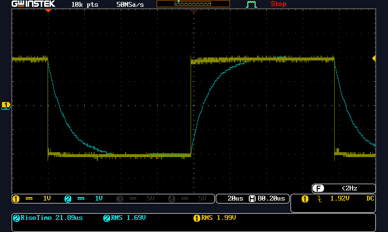

# Simulations for Piezo Circuits.

Using https://www.falstad.com/ for circuit simulation.

These files are saved Falstad export as text method.

Measurement of Piezo properties.

Function generator through 1K into Peizo  Digikey part number: 490-4698-ND 

CH1 is function generator output.
CH2 is at Piezo.

Since we see no instantanious step on the piezo when the function generator switches the ESR of the piezo is very small relative to the 1K through which we are driving the piezo.

The 10-90 % rise time tr is on the order of 20uS the bandwidth is .35/(tr) =0.35/.000021 = 17,620 Hz.
The capacitance of the piezo would be C= 1/(2PiF *1K) = 9 x 10-9 or about 10nF.

The file: TwoPiezoWithResonantInductor330mHand235OhmsMillerCap.txt
Coorisponds to this simulation.

The circuit with the left most transistor is just a reference. The circuit about the right most transistor is the simulation of interest.

The inductor is resonated against not only the capacitance (and ESR) of the Piezo but another parallel capacitor to lower the resonance with out resorting to even larger inductor value.

Simulations at: https://tinyurl.com/2kpx3g5t
