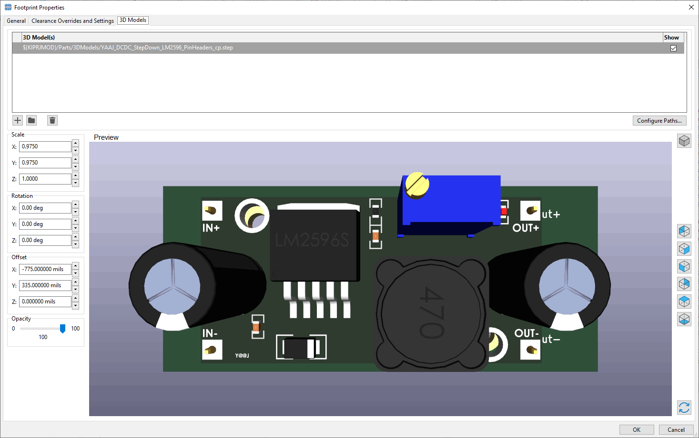

# Notes On Parts

## 3DModels

Switcher module from: https://grabcad.com/library/lm2596-module-for-kicad-1
  

Note the long edge (and pin distance) on this model is slightly larger than the parts I have in hand. My parts have a long axis of 43.34mm and a pin to pin distance of 39.79 x 17.47mm (1.56x0.688 inch)
I set my KiCad scale for x and y scale to 0.975 for an OK fit.

