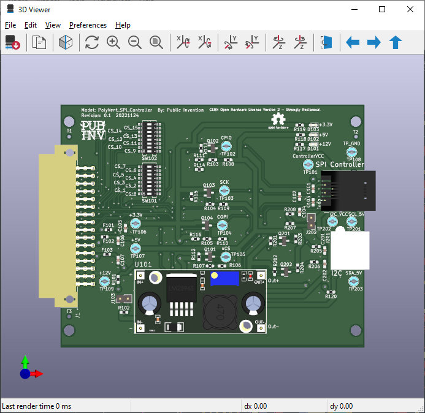

# NOTES FOR THIS BRANCH ONLY

This is a branch with code changes useful for testing the with the PolyVent.

1. We discovered there is a BUILTIN LED load on the CLK line. This is a problem specific to the Arduino UNO
architecture which we (mostly) copied. It can be solved in rework be desoldering restor R103 on the GPAD (NOT the PolyVent SPI card.
2. The code TEST_POLYVENT_LINES is a very SIMPLE test script for transmitting a SINGLE BYTE. It can be loaded on to the PolyVent Architecture to remove all dependence on the (somewhat complicated) VentOS code and test the transmission of SPI through the PolyVent, back plane, PolyVent SPI card, and cable to the GPAD. It has a #define at line 41 for "USE_POLYVENT_ARCH". This code should be commented out if you are using the GPAD as the cotroller, and uncommented if you are using a PolyVent/ESP32 as a controller. 
3. I may have made other changes to the GPAD controller to send SPI bytes. This is messy and needs to be cleaned up and made selectable with a compile time switch or some other mechanism.
4. The GPAD_API code itself (the main code which drives the GPAD device) has been commented out so that it ONLY tests the SPI transmission.

# PolyVent SPI Controller Card
This project is a printed circuit assembly which fits in to the card rack of the Polyvent  
This assembly brings out an SPI (Serial Peripheral Interface) on an RJ12 connector compatible with the GPAD.  
This assembly brings also out an I2C (Inter Integrated Circuit interface) on a 4 pin JST connector similar to the GPAD.  

This is collaboration of Public Invention with the [Sustainable Progress and Equality Collective (SPEC)](https://www.specollective.org/#:~:text=The%20Sustainable%20Progress%20and%20Equality,be%20catalysts%20for%20positive%20change.)

## Schematic and PCB

<a href="SCH_PolyVent_SPI_Controller.pdf" >
Link to SCH

</a>

<a href="PCB_PolyVent_SPI_Controller.pdf" >Link to PCB 

</a>

<a href="PolyVent_SPI_Controller_PCBImage.png" >Link to 3D render screen capture  
 </a>  

<a href="PolyVent_SPI_Controller.step" >Link to 3D step file.</a>

## Face Plate
The faceplate provides mechanical retention of the printed circuit assembly into the card cage and protection against ingress of dust and contaminations. 

  
   
Render of the stl.  

<a href="FacePlate_FCNative_v1_SPI_Controller.pdf" >  

Link to Face Plate mechanical drawing PDF  
</a>  
  
  

## Theory of Operation
This PCB provides two interface methods for level shifting from the 3.3V ESP32 on the PolyVent to the 5V ATmega328 on the GPAD.
They are options achieved by populating different components in the schematic. As of 20221027 17:00 the schematic does not detail these stuffing options.

* One method of using FETs as described for example here: https://www.eeweb.com/level-shifting-techniques-in-i2c-bus-design/.  This may need some design work for selecting the pull up resistors as there are no pull ups on the GPAD interface.
* The second method is to simply connect the signals from the ESP32 output pins (SCL, COPI, nCS) directly to the ATmega328 inputs and rely on the 3.3 Volt logic high to be sufficient for the Atmega328 CMOS inputs. Full analyses is: The Atmega328 logic low input is specified at 0.3*Vcc and logic input hight is specified at 0.7*Vcc. So we have 1.5 and 3.5 per the specifications. 
  
So strictly by the specification the ESP output of even the full 3.3V does not guarentee logic high on the input of the ATmega328.  
The output from the ATmega328 is resistively divided through 1K into 2K to produce 5 * 2/3 = 3.3 Volts on the CIPO signal.

There are dip siwtches for choice of any of the nCS lines of the PolyVent brought out to become the nCS signal. **CAUTION:** Onle one switch should be in the closed position.

## Testing of Version 1 PWAs  
**Reference to Schematic here:**

 <a href = "SCH_PolyVent_SPI_Controller.pdf" >  Press to load PDF. </a>
 
**Reference the PCB layers here:**  

<a href = "PCB_PolyVent_SPI_Controller.pdf" >  Press to load PDF. </a>

1. Unboxing and Mechanical
First label each with a serial number.
The first test is mechanical fit. Even before solding any connector on, slide a board in to the card cage and look for problems. Make a photograph(s) please.
Then IIRC you have three connectors to solder on and test the fit again. Photo(s) again please.

2. Electrical test.
Prepare by identifying all of the currently used chip select lines in the PolyVent firmware or be refernce to the project documentation.
Identify an unused chip select line. Set the dip switches so that one and only one switch selecting chip select is closed. Confirm on and only one Chip Select is selected with a multi meter.

3. Light and play test.
Load some kind of file into the ESP which will use this chip select for an SPI interface.  Send out the SPI interface something that the GPAD is known to react to.

4. If you have the bandwidth to do so, put an oscilliscope on the SPI interface at the test points labled nCS, COPI, CIPO, SCK. Measure for signal high voltage, signal low voltage and time rise and time fall on each signal.  Trigger the oscilliscope on the falling edge of nCS. 

Report results here

## Volunteer Skills and Skills Needed
Project Lead, Product Definition, Robert L. Read, founder of Public Invention.  
Enclosure design, component procurement for rev1, project facilitator, initial board bring-up, board layout design contributor, Lawrence Kincheloe of Speccollective who is a computer scientist by training, and an electrical engineer as well as a hobby inventor by vocation. 
Mentor and coach hardware, firmware, (Forrest) Lee Erickson Physicist who pretends to be electrical engineer and firmware developer and provider of Novel and Diverse Spelling.
Volunteers needed and welcome for review of project documentation and project design.

# License

* Firmware: GLP 3
* Hardware CERN Open Hardware License Version 2 - Strongly Reciprocal

