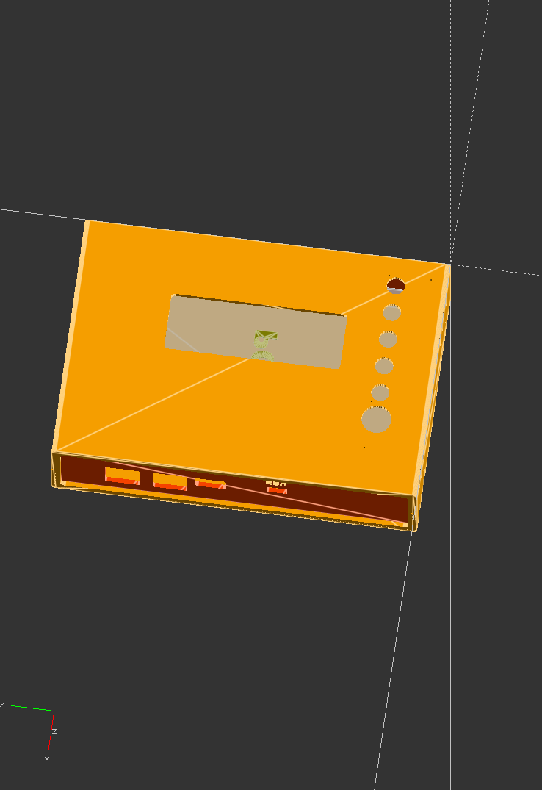

# General Purpose Alarm Device v2.0
AKA the GPAD.

Development of the GPAD is in collaboration with the [Sustainable Progress and Equality Collective (SPEC)](https://www.specollective.org/#:~:text=The%20Sustainable%20Progress%20and%20Equality,be%20catalysts%20for%20positive%20change.) and other individual volunteers.

The GPAD is Certified Open Source Hardware by OSHWA(https://certification.oshwa.org/us002352.html). Our OSHWA UID is [US002352](https://certification.oshwa.org/us002352.html).

GPAD in Prototype Enclosure of Summer 2022


The GPAD Printed Circuit Assembly Version 1

This General-Purpose- Alarm-Device repository defines a 'General Purpose Alarm Device' aka, GPAD module.
This module has an enclosure and inside is an embedded microcontroller system with the following features to alert a human of a condition.
* Flash bright lights
* Make (laughably not) loud tones
* Button to, for example, "mute" or suppress the alarm buzzer.
* Text display status and messages (up to 20x4 characters)
* Power from wall supply on barrel jack 2.1mm at 9-12V <= 1000mA (or from host controlling device at 5V or 12V on the SPI interface)
* RJ12 Data Cable connection for signal (and optional power) between host and GPAD.
* An I2C output for control of devices TBD. Connection by locking JST connector: S04B-XASK-1(LF)(SN)

The GPAD does not detect the conditions that need to be alarmed. It is a peripheral to a controlling host device. The controlling host will assert status through the GPAD to an end user.

# Version 1 GPAD
CAD view of GPAD With Version 1 Enclosure.  
  

User view of GPAD Version 1 Printed Wiring Assembly without enclosure.  
  

View of GPAD Version 1 Printed Wiring Assembly component side.  


# GPAD V1 Build Information
Files we used to build the V1 assemblies. PCB with some SMT Assembly was by JCLPCB in China. Additional parts were ordered and hand solderes in the USA.
[FILES HERE: Hardware/Manufacturing](./Hardware/Manufacturing)


# Example Use Case, The Ventilator

The [Freespireco Project](https://github.com/PubInv/freespireco) is an attempt to build a modular ecosystem of cooperating respiration devices. One thing that devices such as ventilators and oxygen concentrators need to have is to be able to alert someone to dangerous conditions. This can be as simple and gentle as, "it is time for scheduled maintenance," to a far more dangerous, "the hose connected to the patient is disconnected!"
The purpose of the alarm is to get the attention of nurses or doctors who can fix the problem.

See the PolyVent project on Gitlabs at: [https://gitlab.com/polyvent](https://gitlab.com/polyvent)  
See the PolyVent controller at: [https://gitlab.com/polyvent/polyvent_control_module](https://gitlab.com/polyvent/polyvent_control_module)

# The Abstract Application Programmers Interface

GPAD offers a simple API, possibly with a JSON or byte-level interface, for commanding it to alarm.
Abstractly, we can imagine a system that supports five levels of alarm severity.
Additionally, an alarm condition normally has a short message associated with it, such as "hose disconnect", which
should potentially be displayed on a small screen.

The initial version of this API can be extraordinarily simple: Alarm at a level between zero and five, where zero means no alarm.
However, it is clear this API will have to evolve over time. Issues such as when one alarm level supersedes another, when it is
acceptable to silence an alarm and for how long, etc. actually become rather complicated quickly.

We hope that by defining a clearly versioned API we can make an evolving device of great utility for a wide variety of purposes.

# Stand-alone or Sub-assembly

Our fully finished design includes a printed wiring assembly and an enclosure.
All the free and open source KiCad schematic printed circuit assembly files are provided so that users could fabricate just the PCB and use in an enclosure iof their own design. 
The enclosure is designed in the free open source SCAD and we provide the enclosure design source files. Users could fabricate this enclosure as is or develope a modifed enclosure with their own features from the files we provided.

# The Arduino UNO Like Platform

The implementation is Arduino UNO like. A USB interface to an ATmega328 controller is provided for Arduino IDE compatibility.
UNO footprint for shields is provided.
This allows a typical Arduino serial port interface for development and debugging.

# How is the alarm signal received?

The wired RJ12(6P6C)  Data connection from a host is an SPI controller and the GPAD is an SPI Peripheral.

A wireless interface may be added through a UNO shield. (Compatibility with existing wireless shields has not been checked. A custom shield with a wireless interface to some of the unused controller pins should be possible but may not be trivial.)


# Summer 2022 Project Status  

### Firmware
Demonstration of SPI controller and Peripheral for single byte transmission.

### Hardware
1. Schematic with distributor part numbers through review. Many parts have two distributor part numbers identified.
2. Several units assembled. As of 20221208 two reworks identified. One swaping D7 and D10. A Second connecting the DTR on U501 Pin 4 to Reset.

# Possible Evolution Stages of the Project

## Phase I aka Version 1

* Light alert by five, 5mm white LEDs driven at about 20 mA.
* Acoustic alert by buzzer driven by push-pull somewhat less than 5Vp-p.
* Text display with back lit, 20x4 character LCD.
* Single User Button
* Recessed reset button.
* Power on status LED
* USB port for Firmware development and low power operation
* An I2C output for controller of devices TBD. Connection by locking JST connector: S04B-XASK-1(LF)(SN)

Still remaining: define a simple API.
We imagine these hardware choices will evolve over time. We want the API to insulate the user of the GPAD
from specific details of how the noise is made.

Nonetheless, we can make a few comments.
1. It is now possible to get very bright LEDs which are efficient. The initial version might simply use a single very bright LED, or some combination of LEDs supporting 5 levels of alarm color or brightness.

Summer and Fall of 2022 the physical implementation has been realized with the Version 1 PCB and Version 1 3D printable enclosure.

## Phase II
**THESE MAY ALL HAVE BEEN REALIZED IN PHASE I**  
In Phase II, we can imagine a large number of improvements:
1. An enclosure for the electronics which is designed to be easily mounted (for example, with flanges for zip ties.)
2. An updated Printed-circuit board Version 2 that integrates the improvements identified in Phase 1.
3. Improvements in the API.
4.  Although "buzzers" and "sirens" of various kind are available, we eventually want a loudspeaker that can make various noises to provide information about the alarm level. Someday it may even support recorded messages in a human voice speaking a natural language. Imagine the voice of Scotty saying, "She canna' take the strain, Captain!" in a Scottish accent.

## Phase III
**THESE MAY BE NESSISARY TO COMPLETE PHASE II**  
In Phase III, we could expand the usability of the device by allowing it to be made physically versatile, which feature such as:
1. A backup battery on board to make the unit able to operate wirelessly.
2. Sturdiness to the level of being a "throwie" that can be deployed by tossing it across the room.
3. WiFi, Bluetooth, or LoRa enablement.

In each of these phases, we imagine the API improving substantially.

# Volunteer Skills and Skilles Needed

Project Lead, Product Definition, Robert L. Read, founder of Public Invention.

Enclosure design, component procurement for rev1, project facilitator, initial board bring-up, board layout design contributor, Lawrence Kincheloe of Speccollective who is a computer scientist by training, and an electrical engineer as well as a hobby inventor by vocation.

???  Joe Torreggiani of Speccollective

Mentor and coach hardware, firmware, (Forrest) Lee Erickson Physicist who pretends to be electrical engineer,  with experence in firmware development, Design for Manufactur, Design for Test and developer of Novel and Diverse Spelling.

We need volunteers:
1. Arduino engineers who can both code and make very simple circuits.
2. Schematic capture and PCB layout designers.  We are using KiCad.
3. Mechanical engineers who can design sturdy enclosures that keep the system bright and loud.
4. Embedded firmware engineers who can design an effective, evolving API and the transport bindings that they require.
5. GUI experts who can address issues such as how to effective alarm and silence.
6. Marketers who can promote and evangelize the project.
7. Possible a project manager who can organize volunteers and keep them enthused and motivated to move forward.

# The Potential for a Product

Like everything done by Public Invention, this is a fully open project that will be released under fully open hardware and software licenses.
However, unlike many of our projects which are very "researchy" this project could become a scalable product pretty easily.
One can imagine it being sold at Sparkfun, Adafruit, or DigiKey if we do a good job.
Because it could be used for a wide variety of purposes by makers and could be sold with an enclosure at a price of perhaps <=$100USD
As an embedded sub assembly, the printed wiring assembly must be low cost with a material price of < $30USD

Potential uses as a product (by hobbyist) include:
1. Alarming a cat door, bird or squirl at feeder,
2. Alarming when a visual signal, such as an animal moving in a game camera is detected
3. Annunciation of life-threatening conditions in medical devices
4. Overheating conditions in almost any device
...but the reader can probably imagine a great many more.

Public Invention does not wish to become a manufacturer; but we will impartially support anyone who wants to take these designs and manufacture them so long as they abide by the licenses.

# Modular Software Architecture

As this is intended to be a long-term project that will evolve and potentially have many volunteers. The basic software architecture is captured in this diagram:


# The Simplest API

The simplest API could just be:
```
enum AlarmLevel { silent, informational, problem, warning, critical, panic };
int Alarm(AlarmLevel al);
```

The simplest binding for this, which could be used of SPI or a serial port, would simply be the character A followed by the character 0, 1, 2, 3, 4, or 5.
To test the alarm system of the serial port, you could simply type "A3" into the Arduino IDE serial monitor and send this to the GPAD, at which would expect a moderate noise and flashing light to sound and flash.

A slight improvement on this is to specify a message. We have decided that messages should have 80 character, 32 character, and 16 character
versions, and the hardware device will do the best job rendering them in can with available hardware:
```
enum AlarmLevel { silent, informational, problem, warning, critical, panic };
int Alarm(AlarmLevel al);
int Alarm80(AlarmLevel al,char* msg);
int Alarm32(AlarmLevel al,char* msg);
int Alarm16(AlarmLevel al,char* msg);
```
Additionally, it would be nice to have a way to interrogate the current alarm level:
```
AlarmLevel getAlarm(AlarmLevel al);
boolean isMuted();
```

As of Nov. 11th, we are working significantly on this API, which deserves a
a separate document, but I will place notes here.

## The Abstract API
The Abstract API is meant to work independent of specific hardware on
the GPAD. That is, it should be useful for hardware built by other teams
making significantly different decisions.

In this API, the message strings support only the most limited
sort of formating: a linefeed character represents a line break.
Nonetheless, if linefeed characters are used, the will break lines
but this will of course limit the number of ACTUAL characters
that can be rendered, rather than the 60 that we can render if no
line breaks are used.

## The Hardware API

The Hardware API gives a caller complete access to all of the GPAD
hardware. For example, they could address each LED separately.
This is a lower priority. This API is not intended to be used by
medical devices because it is fragile with respect to improvements in
the hardware. Nonetheless, its availability makes the GPAD more useful
for a wider variety of purposes. For example, someone could program a
simple game with the GPAD.

## Separate tranport protocols

In practice, there need to be three ways of invoking the API:
1. Through a human-typable string at the serial port,
1. Through a remote procedure call via the serial port, and
1. Through the SPI interface.

It is our intention to keep all of these mechanisms distinct from the
two APIs. There might even be additional transport protocols in the future,
such as a library that uses I2C ("I-squared C").


# A Simulation with WokWi

We have written in the "simulation" directory both the diagram and two sketches that simulate our hardware. One of them,
that Rob wrote on Saturday, August 13th, implements [this rudimentary api](https://github.com/PubInv/general-alarm-device/tree/main/simulation/robSimulatinSat13), without supporting messages.  
The other shows the use of the LCD.  
These should be integrated together to create the initial firmware for the project.  Meanwhile, we can simulate the device successfully in WokWi.  
While the Version 1 PCBs and PCAs were on order, Lee wrote and sumulated factory test software on WokWi.  See project at: https://wokwi.com/projects/345960281987351124


# Other Product Description  
## White LEDs  
We're going to use white-light LEDs to avoid color-blindness issues for the visual alarm.

# Project Glossary and Organizational Overview

## Issue Labels used
| Label Name  | Short Description  | Detailed Description  |
|---|---|---|
| bug  | Something isn't working  |   |
|  documentation | Improvements or additions to documentation |   |
|  duplicate |  This issue or pull request already exists |   |
|  enhancement |  New feature or request |   |
| firmware  |  For issues related to software running on the microcontroller |   |
| good first  | Good for newcomers | |
| Hardware | Schematic and PCB and Enclosure | |
| help wanted | Extra attention is needed | |
| question | Further information is requested | |
| research | Research products or ideas | |
| wontfix | This will not be worked on | |

# Building the Firmware

The firmware can be built with the standard Arduino IDE.  (Using 1.8.19 as of 20221208)
It requires libraries:
1. Wire.h
1. LiquidCrystal_I2C.h
1. DailyStruggleButton.h  (Installed with library manager and found at: https://github.com/cygig/DailyStruggleButton)

# License

* [Firmware: Affero GPL 3.0](https://www.gnu.org/licenses/agpl-3.0.en.html#license-text)
* [CERN Open Hardware Licence Version 2 - Strongly Reciprocal](https://ohwr.org/cern_ohl_s_v2.txt)
